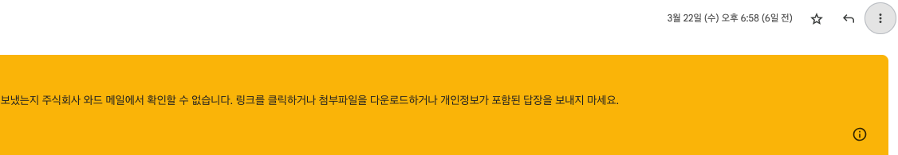

<h3 data-toc-skip>한줄 정리</h3>
SPF 대한 깨달음, smtp 데이터 보는 건 Gmail

<h3 data-toc-skip>발생</h3>
업무에서 회원의 이메일 인증을 위해 이메일을 발송하는 프로세스가 존재한다. 메일을 발송하였으나 아래와 같은 경고 메시지가 계속 나타났다

<h3 data-toc-skip>원인</h3>
발신 이메일의 도메인과 실제 메일을 발송한 서버의 도메인이 상이하였던 것!!
이와 같은 케이스에서 이메일 수신 서버에게 해당 이메일은 안전하다는 것은 spf를 통해서 확인시킬 수 있다.  
(자세한 내용은 링크 참고. https://meetup.nhncloud.com/posts/244)

<h3 data-toc-skip>분석</h3>
메일 우측 상단에 점 3개 버튼을 클릭하면 smtp protocol을 통해 수신한 데이터를 모두 볼 수 있다.

<h3 data-toc-skip>해결</h3>
해당 업무 서비스에서 NHN toast cloud & Naver Cloud 두 곳을 이용해 메일을 발송하고 있었다.  
그러나 발송 도메인에 SPF 값은 NHN toast cloud에 대한 SPF 값만 설정이 되어 있어서 Naver Cloud SPF는 등록되어 있지 않아 계속 위와 같은 노란색 Alert이 나타났다.
참고)
nhn : v=spf1 include:_spfblocka.toast.com ~all  
ncloud : v=spf1 include:email.ncloud.com ~all  
두개 같이 설정하면 ? "v=spf1 include:_spfblocka.toast.com include:email.ncloud.com ~all"
